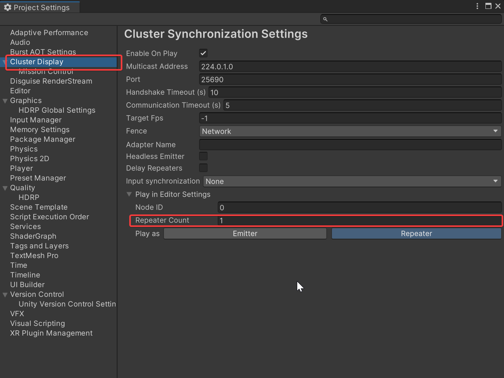
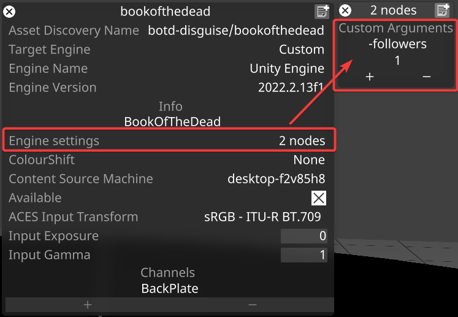

# RenderStream Unity Plugin

For more info please refer to our [RenderStream and Unity Help page](https://help.disguise.one/Content/Configuring/Render-engines/RenderStream-Unity.htm)

A **Demo Unity Project** can be found on the [disguise Resources page](https://download.disguise.one/#resources)

## Installing the RenderStream Unity Plugin

Install this package using the [Package Manager](https://docs.unity3d.com/Manual/upm-ui.html), using one of these methods:
* From a [Git URL](https://docs.unity3d.com/Manual/upm-ui-giturl.html)
* Clone this repository and install from a [local folder](https://docs.unity3d.com/Manual/upm-ui-local.html)
 
## Using the RenderStream Unity Plugin

The act of adding this package to your Unity project, is enough to enable RenderStream in your built executable.

More control can be added using the included Disguise RenderStream components:

* **To enable control of GameObject(s) properties**, attach a Disguise RenderStream > **Remote Parameters** component to the appropriate game object for remote parameter control.
   * Note: you can enable/disable the exact GameObject properties using the List editor in the Unity Inspector.
* **To add designer timeline control**, attach a Disguise RenderStream > **Time Control** component to a Playable Director

## Building a RenderStream asset for Disguise Designer

To use your Unity Project with disguise designer, you build an executable and import it into your designer project. To do this:
* Ensure Build Settings are set to build a **Windows x86_64** executable
* Copy the build folder to your **RenderStream Projects** folder
* In Designer, set up a new RenderStream Layer and point the Asset to your built executable.

## Optional: Cluster Rendering

If you are running RenderStream in a cluster and you sychronization between nodes, you will also need to install the [Cluster Display](https://github.com/Unity-Technologies/ClusterDisplay) package, using one of these methods:

* From the following git URL: https://github.com/Unity-Technologies/ClusterDisplay.git?path=/source/com.unity.cluster-display
* Clone the repository and install the package locally from `path/to/repo/source/com.unity.cluster-display/package.json`

The cluster is composed of one (1) emitter/controller plus one or more repeaters/followers. For example, if your cluster has 4 render nodes, then it has 1 emitter/controller + 3 repeaters/followers. It is important that you inform Unity of the number of repeaters in the cluster:

* Before you build the project, can specify the number of repeaters in **Project Settings | Cluster Display** > **Repeater Count** (you can leave all other "Play in Editor" settings alone).

* Optionally, after you've built the project, you can also specify (or override) the repeater/follower count in Designer by adding the following custom arguments in the "Engine Settings" of the Cluster Workload asset: `-followers`, `N` where `N` is the number of repeaters/followers in the cluster (1 less than the number of nodes).

## Notes:

* The Scene Origin in Designer corresponds to the initial position of the camera in the Unity Scene.
* Firewall settings can interfere with transport streams and/or cluster communication. You may see a Windows security dialog pop-up the first time you run the asset.
   * Click Enable / Allow on this Windows pop-up to allow RenderStream communication to/from designer.
*  If the firewall is the problem check your outbound firewall rules on the Unity machine, and the inbound firewall rules on the disguise machine for either software being specifically blocked.
